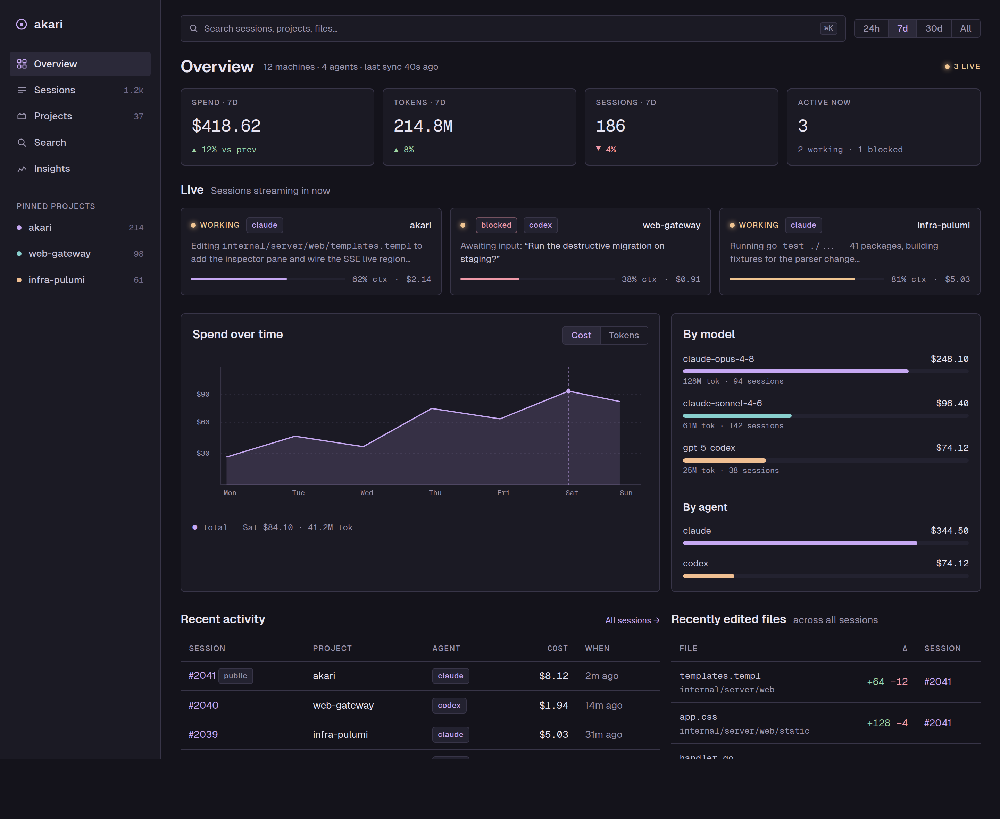
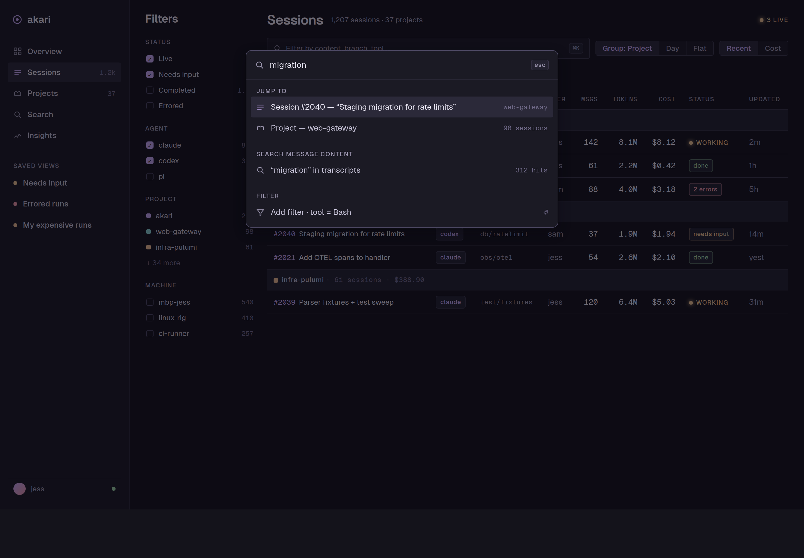
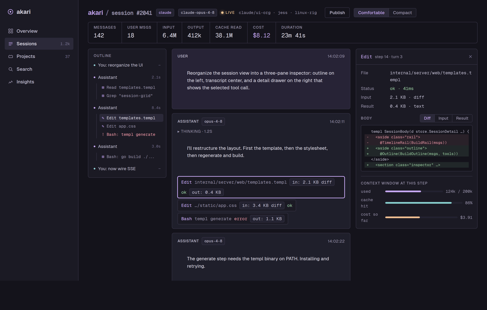

# UI reorganization proposal

A proposal to make akari's web UI easier to navigate and act on without
abandoning the "Machinist's Bench" design system. The current UI is clean and
on-brand, but the *information architecture* is thin: there is one flat top bar,
every page is essentially one wide table, and the two things a reader actually
comes for (**reading a single run deeply** and **seeing where spend and
activity are going across the fleet**) are reachable only by drilling down from
a projects table. This proposal keeps every existing capability and reorganizes
how you reach and scan it.

Mockups (rendered in akari's own tokens and Geist fonts) live in
[`docs/mockups/`](./mockups):

| Screen | Mockup |
| --- | --- |
| Overview (new landing) | [`01-overview.png`](./mockups/01-overview.png) |
| Sessions (global, faceted, ⌘K) | [`02-sessions.png`](./mockups/02-sessions.png) |
| Session trace inspector | [`03-session-detail.png`](./mockups/03-session-detail.png) |

The mockups are static HTML you can open in a browser
(`docs/mockups/01-overview.html`) and re-render to PNG with the script noted at
the bottom.

---

## 1. What's hard about the UI today

Reading the templates (`internal/server/web/templates.templ`) and the product
brief, the friction is structural, not cosmetic:

1. **There is no home.** The root route is the *projects table*. A developer
   landing on akari first sees an alphabetical-ish list of repos, then has to
   pick one to see anything about recent runs, live sessions, or spend. The
   "watching the spend" and "debugging a run" jobs from `PRODUCT.md` both start
   with a detour.
2. **Navigation is three flat links.** `Projects · Search · Account`. There is
   no way to get to "all sessions across every project," to "what's running
   right now," or to "errored runs" without first choosing a project. Search is
   a separate page rather than something always at hand.
3. **Everything is a single wide table with no scanning aids.** Sessions are a
   flat list with three dropdown filters (agent / user / machine) and a Filter
   button. There's no faceted filtering with counts, no grouping, no saved
   views, no full-text filter inside the list, no status column. Finding "the
   blocked codex run on web-gateway" means knowing which project it's in first.
4. **Live and "needs input" are invisible at the fleet level.** A session shows
   a `live` dot only once you're *inside* it. The most time-sensitive
   information (which agents are running, which are blocked waiting on a human)
   has nowhere to surface. (Both Claude Code's agent view and Datadog Lapdog
   make live status a first-class, top-level signal.)
5. **The session view is genuinely minimal where it should be richest.** The
   deep-read view is the product's hero, but its only navigation aid is a 46px
   rail of colored ticks, and tool bodies expand *inline* in the reading column,
   so inspecting a large diff shoves the transcript around and you lose your
   place. There's no persistent inspector, no per-step context-window/cost
   readout, no step outline.
6. **Cross-cutting questions have no view.** "Which files did agents touch
   recently?", "what did this branch's runs cost?", "show me every Bash failure
   this week": none of these are answerable, because the only axis is
   project → session.

## 2. What comparable tools do well

I looked at the tools you named and the broader tracing space.

- **Datadog Lapdog**: a left session list, a per-session trace of prompts /
  tool calls / responses, token+cost broken down by input/output/cache, a
  **context-window usage and cache-hit-rate chart over the session**, and a
  **live agent status** (running / idle / blocked) surfaced prominently.
  ([docs](https://docs.datadoghq.com/llm_observability/lapdog/),
  [walkthrough](https://chrisebert.net/see-what-your-ai-coding-agent-is-doing-with-datadog-lapdog/))
- **AgentsView** (kenn-io): local-first, multi-agent, and closest in spirit to
  akari. Worth stealing from: a **dashboard landing** (spend, daily charts,
  per-model/per-session cost), an **activity heatmap**, a **"recently edited
  files" feed** that groups the files agents changed across every session and
  links to the message that made each change, **grouping by project / model /
  agent**, and **keyboard-first navigation** (`j`/`k`, `⌘K`, `?`).
  ([usage](https://www.agentsview.io/usage/))
- **Claude Code's agent view**: sessions grouped by **state** ("Needs input /
  Working / Completed"), each row showing whether it needs you and its last
  response. State-first grouping is the key idea.
  ([docs](https://code.claude.com/docs/en/agent-view))
- **LangSmith / Langfuse**: the canonical **master-detail trace view**: a
  hierarchical step/span tree on one side, and a **detail panel/drawer** on the
  other showing the selected step's inputs, outputs, and metrics, so inspecting
  a step never disturbs the overview. Langfuse recently unified this into a
  single resizable drawer.
  ([LangSmith](https://docs.langchain.com/langsmith/observability),
  [Langfuse](https://langfuse.com/docs/observability/overview))

The common thread: a **real landing surface**, **persistent navigation with a
command palette**, **state- and facet-driven lists**, and a **master-detail
inspector** for the deep read. akari has the data for all of this already (the
parser produces messages, tool calls with input/result CAS bodies, token classes
including cache, status, branch, machine, live SSE). It's an organization gap,
not a data gap.

## 3. Proposed information architecture

Replace the three-link top bar with a **persistent left sidebar** and add one
new top-level surface (Overview). Net nav:

```
Overview      ← new landing: fleet state, live, spend, recent activity & edits
Sessions      ← new: every session across all projects, faceted + grouped
Projects      ← keep, but as a peer, not the home
Search        ← promoted into the always-present ⌘K palette (page still exists)
Insights      ← optional: the analytics/breakdowns given room to breathe
Account
─ Pinned projects / Saved views  (per-user shortcuts)
```

Three structural moves do most of the work:

1. **A landing Overview** so both front doors (deep read, fleet spend) are one
   click, and live/blocked runs are visible immediately.
2. **A global Sessions view** with a faceted filter rail (status, agent,
   project, machine, each with counts), grouping (by project / day / flat),
   in-list content filter, and saved views. This is the missing "find a run"
   surface that doesn't require picking a project first.
3. **A master-detail session inspector**: keep the transcript as the center of
   gravity, but replace the tick rail with a real **step outline** and add a
   **right-hand inspector drawer** for the selected tool call (bodies, diff,
   status, timing) plus a **context-window / cost readout at that step**. Tool
   bodies open in the drawer, not inline, so the transcript never reflows.

### Overview (mockup 1)



- **KPI tiles** with deltas: spend, tokens, sessions, active-now, over a global
  time range toggle (24h / 7d / 30d / All).
- **Live strip**: the running and blocked sessions as cards, each with a
  one-line "what it's doing", a context-window bar, and cost so far. Blocked
  ("needs input") reads in rose. This is the agent-view / Lapdog idea applied at
  the fleet level.
- **Spend over time** (reusing the existing SVG chart module) beside a
  **by-model / by-agent breakdown** (reusing the existing bar component).
- **Recent activity** feed (sessions across *all* projects) and a **recently
  edited files** feed: the AgentsView idea, and a genuinely new capability that
  answers "what changed lately" without opening sessions one by one.

### Sessions (mockup 2)



- **Faceted left rail** with live counts: Status (Live / Needs input /
  Completed / Errored), Agent, Project, Machine. Multi-select; active facets
  show as removable chips above the table.
- **Grouping** toggle (Project / Day / Flat) and **sort** (Recent / Cost), plus
  an in-list content/branch/tool filter.
- **Status column** at last (`working`, `needs input`, `done`, `N errors`),
  carried by label + hue, never color alone (per the a11y rules in `PRODUCT.md`).
- **Saved views** in the sidebar ("Needs input", "Errored runs", "My expensive
  runs") are just persisted facet sets.
- **⌘K command palette** (shown open): jump to a session/project, search message
  content, or add a filter: Search promoted from a buried page to an
  always-available action, with `j`/`k`/`?` keyboard nav to match the
  power-user, desktop-first audience.

### Session trace inspector (mockup 3)



- **Stat strip** unchanged in spirit (the instrument readouts), just consolidated
  into one bordered strip that still sticks on scroll.
- **Left: step outline** replacing the 46px tick rail. Turns are collapsible,
  tool steps nest under their turn with per-turn duration, and errored steps
  flag in rose. You can see the *shape* of the run and jump to any step. (The
  existing rail already carries the data for this: roles, tool counts, error
  flags.)
- **Center: the transcript**, essentially as today (messages, thinking, tool
  chips), but bodies no longer expand inline.
- **Right: inspector drawer** for the selected tool call: file, status+timing,
  input/result sizes, a **Diff / Input / Result** body toggle (the editing-tool
  diff you already render, now in a stable panel), and a **context-window /
  cache / cost readout at that step**: the Lapdog-style instrument, per-step.
  This is the master-detail pattern from LangSmith/Langfuse: inspecting never
  disturbs reading.

## 4. What this preserves

- The whole **design system** is untouched: these mockups use akari's exact
  tokens, Geist/Geist Mono, hairline borders, tabular numerics, lilac-as-signal,
  machined-rectangle tags. The One Voice / Tag-is-not-a-pill / tabular rules all
  hold.
- The **templ + htmx, no-Node, server-rendered** posture holds: the sidebar,
  facet rail, grouping, and inspector are all server-rendered partials swapped
  with htmx, exactly like the current filter form and SSE body. The command
  palette and `j`/`k` nav are the only additions to the existing small `app.js`.
- Every current capability survives: publish/unpublish, delete, subagents,
  density toggle, public pages, live SSE, the analytics panel and charts. They
  move to better-signposted homes; none are removed.

## 5. Suggested sequencing

Roughly in order of value-to-effort:

1. **Sidebar shell** + move Projects/Search/Account into it (pure layout; no new
   data). Immediately fixes "navigation is three flat links."
2. **Global Sessions view** reusing `SessionList` + the existing facet query,
   extended to multi-select facets with counts and a status column. Highest-
   value single change for "finding a run."
3. **Overview landing**: assembled almost entirely from components that already
   exist (stat tiles, chart, breakdown bars, `SessionList`); the live strip and
   "recently edited files" feed are the only new queries.
4. **Session inspector**: outline from the existing `BuildRail` data; move tool
   bodies into a right drawer. The biggest UX win for the deep read, and the
   most involved, so it lands last.

## 6. Open questions for you

- **Live status source.** The live strip and the "needs input" status need the
  server to know an agent is blocked-on-human vs. just idle. Lapdog/agent-view
  get this from the agent; akari ingests session bytes after the fact. Is
  "needs input" inferable from the trailing transcript, or is it out of scope
  until clients report live state?
- **"Recently edited files" granularity.** Worth materializing edited paths per
  session (from Edit/Write tool inputs) into a small index, or compute on the
  fly? Affects whether the Overview feed is cheap.
- **Insights as its own page** vs. keeping analytics inline on Overview +
  Projects. I left it as an optional nav item; happy to drop it if the inline
  panels are enough.

---

*Mockups were generated as static HTML in akari's design tokens and rendered to
PNG with headless Chromium (`--screenshot`, 2× scale). To regenerate after
editing the HTML:*

```sh
chrome --headless --screenshot=out.png --window-size=1440,1180 \
  --force-device-scale-factor=2 file://$PWD/docs/mockups/01-overview.html
```
